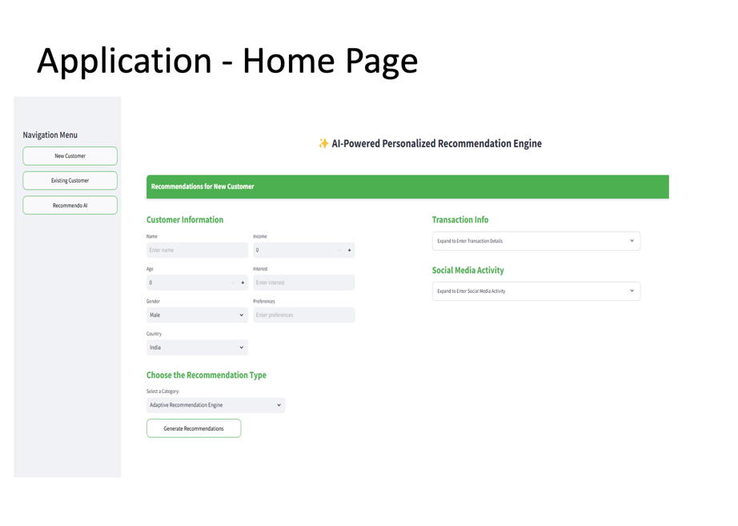
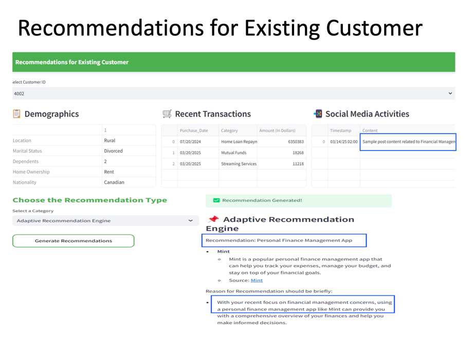
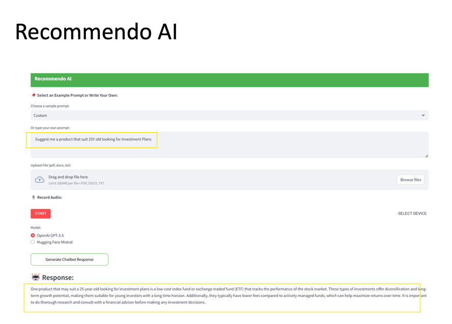

# 🚀 AI-Powered Customer Recommendation Engine

## 📌 Table of Contents
- [Introduction](#introduction)
- [Demo](#demo)
- [Inspiration](#inspiration)
- [What It Does](#what-it-does)
- [How We Built It](#how-we-built-it)
- [Challenges We Faced](#challenges-we-faced)
- [How to Run](#how-to-run)
- [Tech Stack](#tech-stack)
- [Team](#team)

---

## 🎯 Introduction
This project is a **Streamlit-based AI-powered customer recommendation engine** that analyzes **transaction history, social media activity, and demographic details** to generate personalized recommendations using **Hugging Face Mistral-7B** and **OpenAI GPT-3.5**.

## 🎥 Demo
🔗 [Live Demo](#)   https://ai-recommendations-app-214533529948.us-central1.run.app/

📹 [Video Demo](#) (if applicable)  

🖼️ Screenshots:




🖼️ Test Evidences:

⚙️ Architecture Diagram:


## 💡 Inspiration
The project was inspired by the need for **data-driven customer engagement** in e-commerce and finance, providing AI-driven product and service recommendations.

## ⚙️ What It Does
- **Customer Profiling**: Analyzes demographics, transactions, and social media activity.
- **AI-Powered Recommendations**: Uses **Hugging Face Mistral-7B** and **OpenAI GPT-3.5**.
- **Multi-Modal Personalization**: Supports text, voice, and file uploads.
- **Real-Time Audio Input**: Uses WebRTC for capturing voice data.
- **Chatbot Interaction**: Provides interactive, AI-powered responses.

## 🛠️ How We Built It
- **Frontend**: Built with **Streamlit**, featuring a user-friendly UI.
- **Backend**: Utilizes **LangChain** for AI-powered recommendations.
- **Models Used**: Hugging Face **Mistral-7B**, OpenAI **GPT-3.5**.
- **Data Sources**: CSV files for **customer profiles, transactions, and social media activity**.

## 🚧 Challenges We Faced
- Integrating multi-modal inputs (text, voice, files) into a seamless experience.
- Optimizing AI-generated recommendations for accuracy and relevance.
- Managing API rate limits for OpenAI and Hugging Face.

## 🏃 How to Run
### Prerequisites
Ensure you have the following installed:
- **Python 3.8+**
- **Streamlit**
- **Google Cloud SDK** (for deployment if required)

### Steps to Run
1. Clone the repository:
   ```sh
   git clone https://github.com/ewfx/aidhp-code-warriors.git
   cd aidhp-code-warriors/code/src/ai_recommendation_engine
   ```
2. Install dependencies:
   ```sh
   pip install -r requirements.txt
   ```
3. Configure API keys in `config.ini`:
   ```ini
   [huggingface]
   access_token = YOUR_HUGGINGFACE_API_KEY

   [openai]
   api_key = YOUR_OPENAI_API_KEY
   ```
4. Run the application:
   ```sh
   streamlit run streamlitui.py
   ```

## 🏗️ Tech Stack
- **Frontend**: Streamlit
- **Backend**: LangChain, Python
- **AI Models**: Hugging Face Mistral-7B, OpenAI GPT-3.5
- **Other**: Google Cloud Run, WebRTC

## 👥 Team
- **Veerabhadra Dharmapuri**
- **Mounika Boorugu**
- **Phaninder Pathri**
- **Siva Prasad V Pakala**
- **Vinaya R**